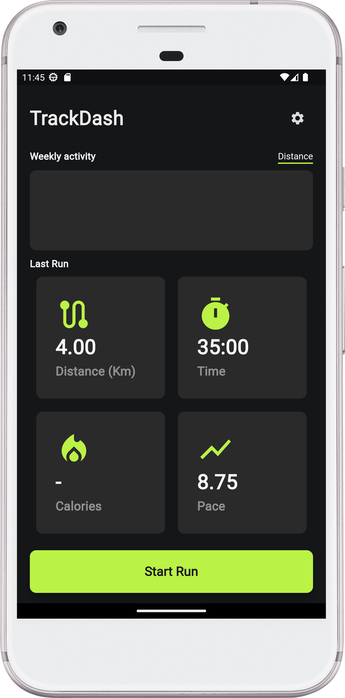
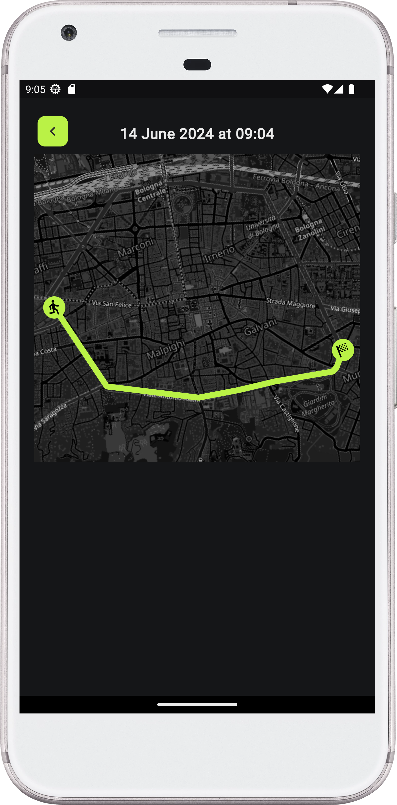

# TrackDash
A simple running tracker app. 

## Features
Features currently implemented and future updates 
Feature | 📱  | Notes
:------------ | :------------- | :-------------
Geolocator     | ✔️
Map to display route  | ✔️
Save activities to local storage  | ✔️
Visualize old activities | ✔️
Delete old activities | ✔️
Insert user information for calorie calculation | ✔️
Pause/Resume activity | ✔️
Calorie calculation | ❌ 
Weekly activities graph | ❌
App Functionality in Background | ❌
Settings | ❌ | The button is there but there are no settings atm

## Images
<div>
  

</div>


## Built With
IDE: Android Studio Dolphin | 1.3.2021
</br>
Framework: Flutter v3.22.0

## Release compilation
Make sure to be in the trackdash/ directory. 
- Android: ```flutter build apk --split-per-abi```
